# AS400 Quantum Suite

AS400 Quantum Suite is an enterprise desktop monitoring and administration application for IBM i (AS/400) systems. It helps operators monitor server health in real time, log historical metrics, track subsystem and service status, audit backup job executions, and generate operational reports for performance review.

This project is built with **Python** and **PyQt6**, utilizing asynchronous multi-threading (`QThread`) over IBM DB2 ODBC connections for live system monitoring, backup auditing, alerting, and local historical logging.

---

## 1. Overview

The application provides a central dashboard for monitoring LPARs, system performance, and critical operational jobs. It is engineered for IT operations, infrastructure support, and system administrators who need to quickly identify CPU spikes, ASP disk usage concerns, subsystem issues, backup failures, or downtime patterns.

**Main capabilities include:**
- Real-time IBM i LPAR monitoring  
- CPU, ASP, and active job tracking  
- Subsystem and service health visibility  
- Dedicated **Backup Management Module** for Daily and Journal backup tracking  
- Append-only monthly historical logging (`daily_backup_YYYY-MM.json`) with record deduplication  
- Dynamic month dropdown filtering for historical audit reporting  
- Multi-threaded asynchronous DB2/ODBC query execution (`QThread`)  
- Local JSON logging with offline retention
- Email alert configuration and testing (SMTP)  
- Version update monitoring and expiration checks  

---

## 2. Features

### 2.1 Real-Time Monitoring Dashboard
Displays live LPAR status, active server indicators, and key performance indicators without blocking the main UI thread.

### 2.2 CPU and ASP Monitoring
Continuously captures:
- CPU usage percentage  
- ASP utilization  
- Active jobs  
- Server status  
- Health flags and warnings  

### 2.3 Subsystem and Service Tracking
Monitors:
- Active subsystems  
- Down or inactive subsystem services  
- Health checks for expected services  
- Status-based operational summaries  

### 2.4 Backup Management Module
Dedicated interface (`BackupManagementWidget`) to query, display, and audit backup operations:
- **Job Tracking:** Monitors `Daily` and `Journal` backup jobs (e.g., `DAILYSWA`, `JRNBKUP`).  
- **Execution Analytics:** Calculates start time, end time, run duration, and job status (`RUNNING`, `COMPLETED`, `FAILED`).  
- **Active Server Selection:** Dynamic button styling and ascending server name sorting.  

### 2.5 Monthly Historical Logging & Deduplication
- Stores log history in month-based JSON archives (`daily_backup_YYYY-MM.json`, `journal_backup_YYYY-MM.json`).  
- Merges newly fetched records with existing logs while removing duplicates using `(job_name, start_time)` composite keys.  
- Preserves full log records across multiple servers.  

### 2.6 Dynamic Month Selection Filter
Includes an intelligent `QComboBox` month selector that scans the log directory for available monthly JSON archives and filters records dynamically.

### 2.7 Monthly Reporting
Produces monthly performance trends and operational summaries, with Excel-based output for easier sharing.

### 2.8 Email Alerts
- Supports SMTP-based email alerts for degraded health, backup failures, or downtime.  

### 2.9 App Security and Version Control
Includes:
- Version expiration checks  
- Minimum supported version enforcement  
- Update prompts when newer builds are available  

---

## 3. Screenshot Placeholders

- **Main Dashboard**  
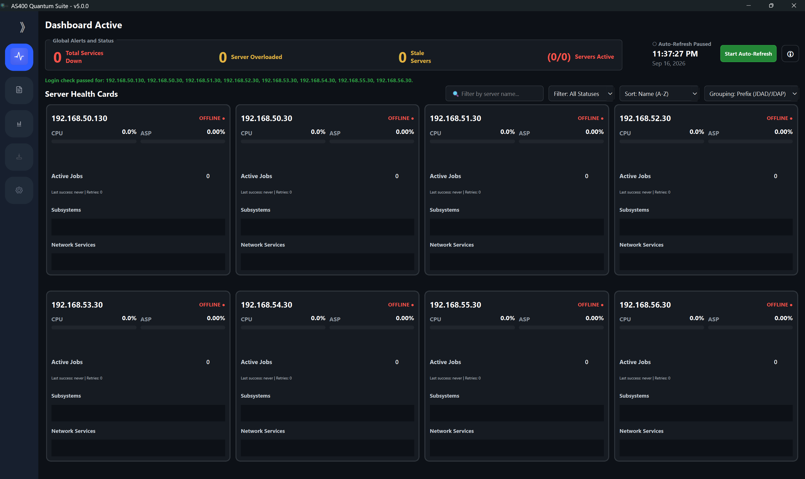

- **LPAR Monitoring**  
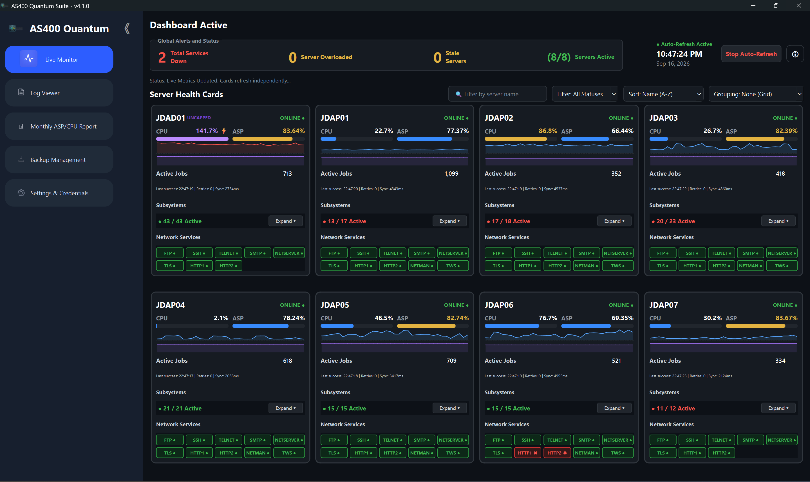

- **Log Viewer & Backup Management**  
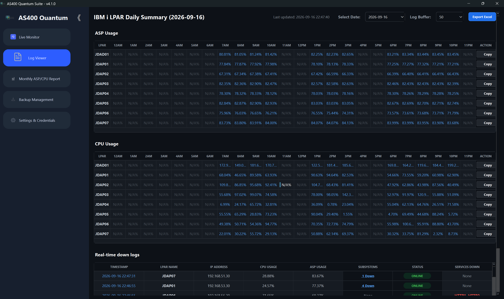
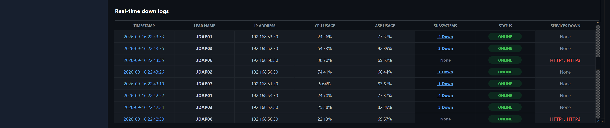
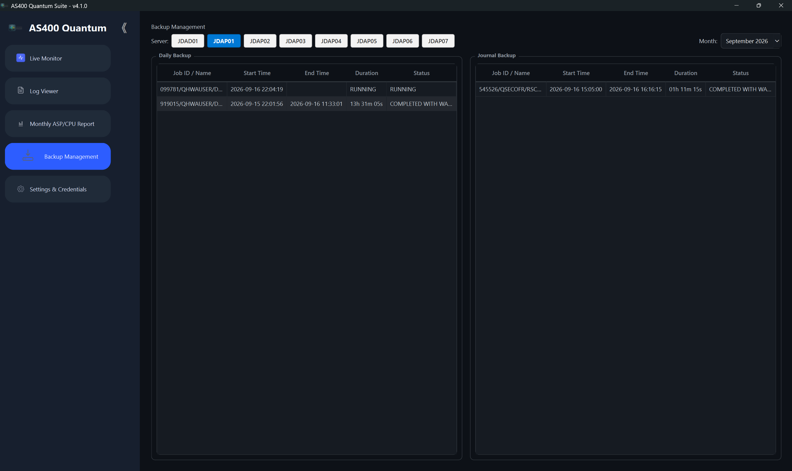

- **Monthly Report**  
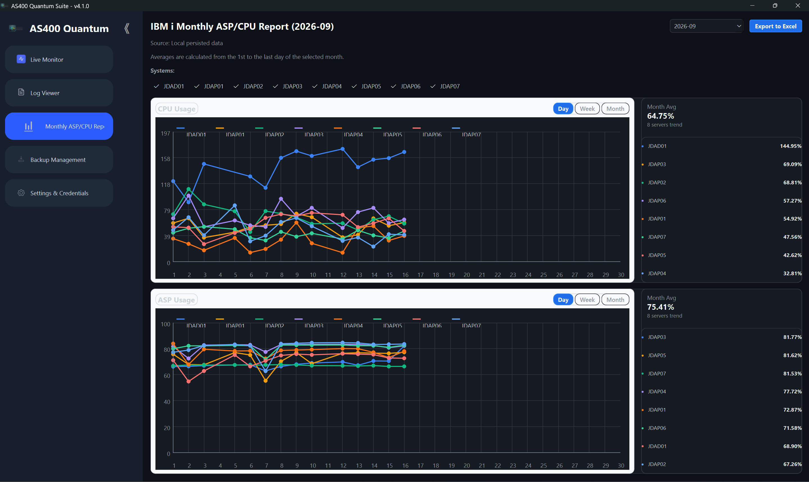
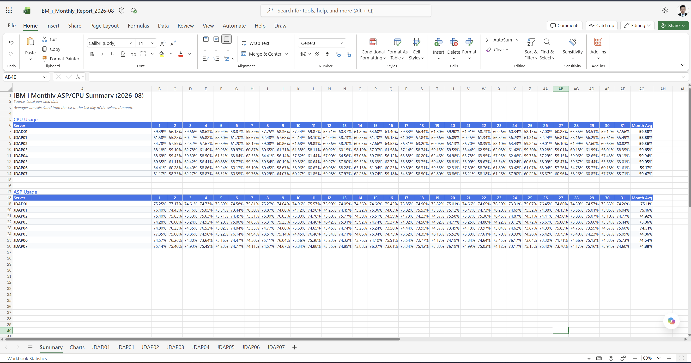
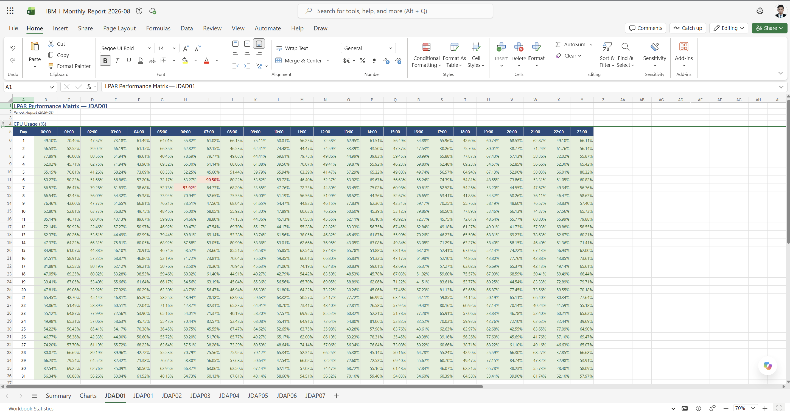
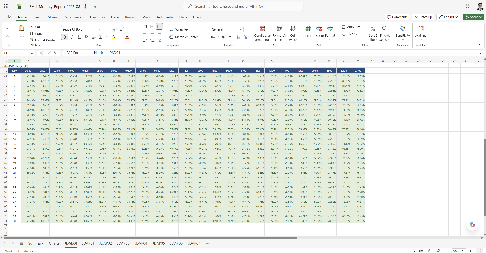

- **Alert / SMTP Settings**  
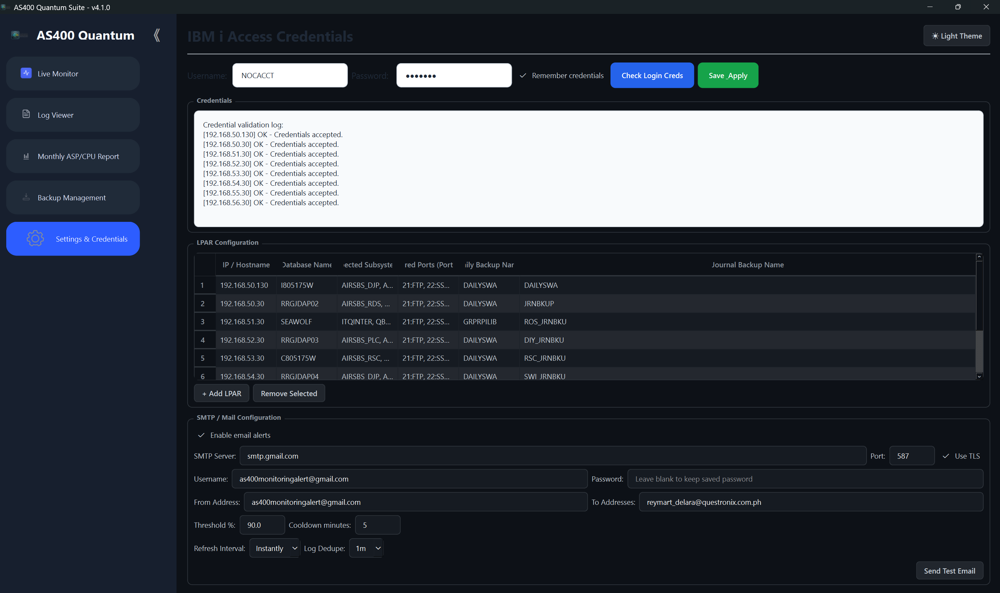
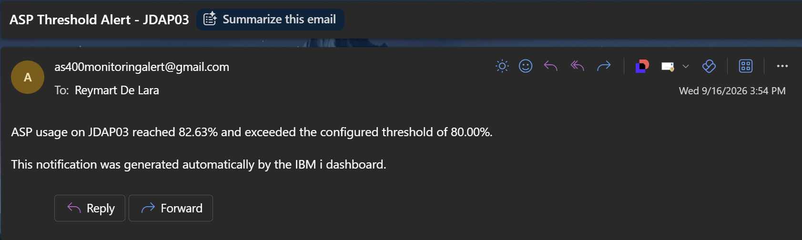

---

## 4. System Requirements

### Minimum
- Windows 10 or later  
- Python 3.10+  
- PyQt6  
- IBM i Access ODBC Driver (System i Access ODBC Driver)  
- Access to IBM i system or AS/400 environment over TCP/IP  
- Valid credentials for the target LPAR(s)  

### Recommended
- Stable network connectivity  
- VPN access if required  
- File write access for logs/reports  
- Secure SMTP configuration  

---

## 5. Installation

1. Clone or open the project folder.  
2. Install required Python dependencies:  
   ```bash
   pip install -r requirements.txt

3. Install the IBM i Access ODBC driver (Windows package from IBM).
4. Run the installer and ensure the ODBC Driver component is installed.
5. Launch the application:
   ```bash
   python src/main.py

6. Configure target IBM i servers and credentials inside the app settings.

## 6. Configuration & DB2 SQL Setup

- LPAR connection details (Host IP, DB name, backup job naming rules)

- SMTP alert credentials and thresholds

- Monitoring refresh intervals

- Log file directory (get_logs_dir())

⚠️ Note: Do not include trailing semicolons (;) in DB2 SQL queries inside worker.py. They cause SQL0104 errors under pyodbc.

## 7. How the Application Works

1. User configures IBM i server connections and credentials.
2. UI loads configured LPAR entries and sorts server select buttons.
3. QThread workers execute DB2 SQL queries to pull metrics and backup status.
4. Backup records are deduplicated and appended into monthly JSON files.
5. BackupManagementWidget updates table views according to server and month filter.
6. Logs remain in local monthly JSON archives; SMTP alerts trigger if thresholds are exceeded.

## 8. Typical Usage Flow
- Start Monitoring: Configure profiles, test connectivity, launch monitoring threads.

- Backup Management & Auditing: Inspect Daily/Journal backup status, filter by month, detect failures.

- Review Logs & Reports: Check subsystem/service health, export monthly summaries to Excel.

## 9. Project Structure

  ```plaintext
AS400QuantumSuite/
├── Image & Sound/                 # Application logos, navigation icons, and sounds
├── src/
│   ├── main.py                    # Main application entry point
│   ├── config.py                  # Log directories and server config management
│   ├── dialogs.py                 # Configuration and credentials dialogs
│   ├── data_store.py              # Local JSON log storage module
│   ├── worker.py                  # Async QThread workers for DB2 ODBC queries
│   ├── version_worker.py          # Application update and version checking thread
│   └── ui/
│       ├── main_window.py         # Primary GUI layout and navigation
│       ├── setcreds.py             # Settings and secure credential persistence
│       ├── backup_manage_2.py     # Backup Management Widget (Monthly JSON & Filtering)
│       ├── log_viewer.py          # Historical log viewer UI
│       ├── monthly_report.py      # Monthly report generator
│       ├── styles.py              # Application stylesheet and button themes
│       └── widgets.py             # Custom reusable UI widgets
├── tests/
│   └── test_hourly_log_recording.py
├── requirements.txt               # Dependencies (PyQt6, pyodbc, openpyxl, etc.)
├── setup.iss                      # Inno Setup installer script
├── version.json                   # Version manifest
├── README.md                      # Project documentation
└── AS400QuantumSuite.spec         # PyInstaller spec file
```
## 10. Troubleshooting

- **SQL0104 Error:** Ensure SQL queries inside `worker.py` do not end with a trailing semicolon (`;`).  
- **Backup records not showing:** Verify log files exist in the logs directory (`daily_backup_YYYY-MM.json`).  
- **Application does not start:** Ensure Python 3.10+ is installed, dependencies are met, and IBM i Access ODBC Driver is configured under Windows ODBC Data Source Administrator.  

---

## 11. Document Revision

- **Version:** 1.1  
- **Status:** Updated with Backup Management Module, Monthly JSON Archiving, and DB2/ODBC Integration.  