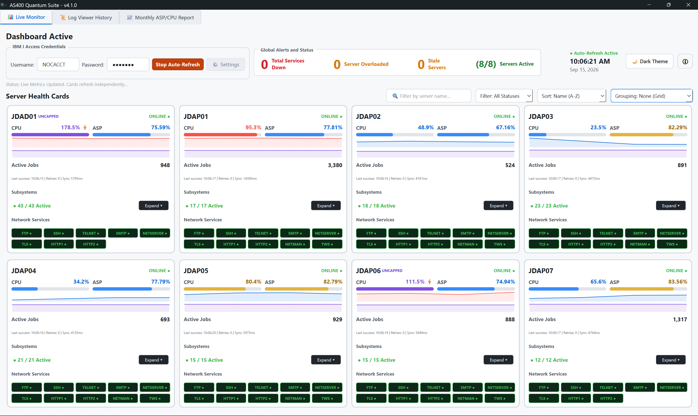
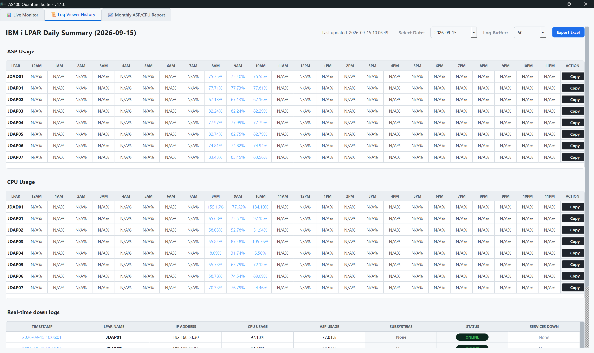
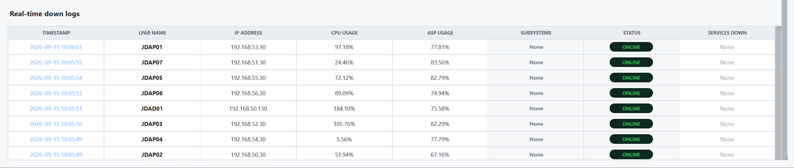
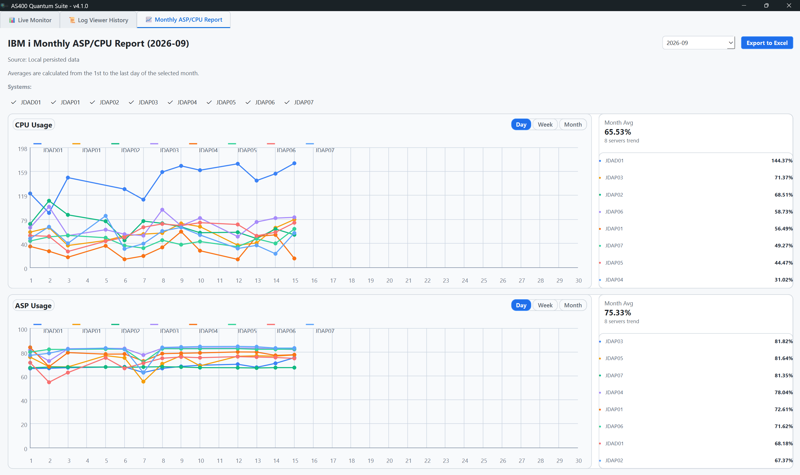
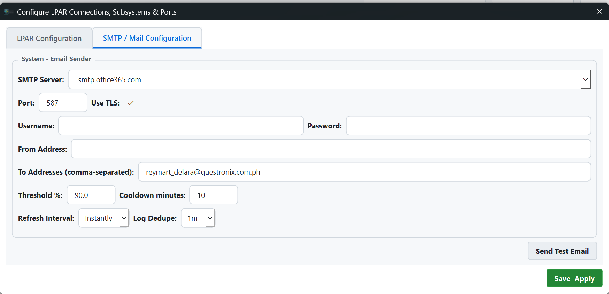

# AS400 Quantum Suite

AS400 Quantum Suite is a desktop monitoring application for IBM i (AS/400) systems. It helps operators monitor server health in real time, log historical data, track subsystem and service status, and generate monthly reports for performance review.

This project is built with Python and PyQt6, and is designed for live system monitoring, alerting, and operational reporting.

---

## 1. Overview

The application provides a central dashboard for monitoring LPARs and system performance. It is useful for IT operations, infrastructure support, and system administrators who need to quickly identify CPU spikes, ASP usage concerns, subsystem issues, or downtime patterns.

Main capabilities include:

- Real-time IBM i LPAR monitoring
- CPU, ASP, and active job tracking
- Subsystem and service health visibility
- Automatic daily historical log collection
- Monthly performance and usage reporting
- Email alert configuration and testing
- Version update monitoring and expiration checks

---

## 2. Features

### 2.1 Real-Time Monitoring Dashboard
The dashboard displays live LPAR status and key performance indicators for connected IBM i systems.

### 2.2 CPU and ASP Monitoring
The application continuously captures resource indicators such as:

- CPU usage percentage
- ASP utilization
- Active jobs
- Server status
- Health flags and warnings

### 2.3 Subsystem and Service Tracking
The system can monitor:

- Active subsystems
- Down or inactive subsystem services
- Health checks for expected services
- Status-based operational summaries

### 2.4 Daily Log Recording
The app records monitoring results into daily history logs to support review and investigation.

### 2.5 Monthly Reporting
Monthly reports can be produced for performance trends and operational summaries, including Excel-based output for easier sharing.

### 2.6 Email Alerts
The software supports SMTP-based alerts that can notify users about degraded system health or downtime conditions.

### 2.7 App Security and Version Control
The app includes checks for:

- version expiration
- minimum supported version enforcement
- update prompt when newer builds are available

---

## 3. Screenshot Placeholders

Use the spaces below to insert your screenshots manually when needed.

### 3.1 Main Dashboard Screenshot


### 3.2 LPAR Monitoring Screenshot




### 3.3 Log Viewer Screenshot





### 3.4 Monthly Report Screenshot




### 3.5 Alert / SMTP Settings Screenshot



---

## 4. System Requirements

### Minimum Requirements

- Windows 10 or later
- Python 3.10+
- PyQt6
- Access to IBM i system or AS/400 environment
- Valid credentials for the target LPAR(s)

### Recommended Setup

- Stable network connectivity to the IBM i server
- VPN access if required by your environment
- File storage access for log export or report generation
- Secure SMTP configuration for alerting

---

## 5. Installation

1. Open the project folder.
2. Install the required Python dependencies:

```bash
pip install -r requirements.txt
```

3. Install the IBM i Access ODBC driver required by the application. Download the IBM i Access Windows package from the official IBM link:

https://iwm.dhe.ibm.com/sdfdl/v2/regs2/sharee2/iacs-java/v1r1/Xa.2/Xb.Fjx4e5cjFUBBN6WveYaTYQUVDrUwH9oSQEE3pbzfhJY/Xc.iacs-java/v1r1/IBMiAccess_v1r1_WindowsAP_English.zip/Xd./Xf.lPr.D1vk/Xg.14048709/Xi.swg-ia/XY.regsrvs/XZ.sMUhEVEnrDT_IfG2xdnVl9RcxCoxpjff/IBMiAccess_v1r1_WindowsAP_English.zip

4. Run the IBM i Access installer and ensure the ODBC driver component is installed and available on the system.
5. Run the application:

```bash
python src/main.py
```

6. Configure the target IBM i server settings from the app interface.

---

## 6. Configuration

The application uses configuration values for:

- LPAR connection settings
- SMTP alert settings
- Monitoring refresh intervals
- Expected subsystem/service checks
- Report output directories

The configuration file is stored in the application data directory for the current user profile.

---

## 7. How the Application Works

1. The user enters IBM i access settings.
2. The dashboard loads configured LPAR entries.
3. Monitoring starts and collects live system metrics.
4. Health checks compare current values against expected thresholds.
5. Results are displayed on the dashboard.
6. Data is saved to daily logs for historical review.
7. Monthly reporting can be generated from stored log records.

---

## 8. Typical Usage Flow

### Start Monitoring
- Add or configure IBM i server settings
- Verify credentials and connectivity
- Start the monitoring process from the dashboard

### Review System Health
- Observe CPU, ASP, and active job values
- Check subsystem status and service conditions
- Review alerts for abnormal system behavior

### Review Logs
- Open the log viewer for historical daily records
- Inspect down services or failed subsystem checks
- Analyze trends over time

### Generate Reports
- Select the monthly report function
- Export a report for internal review or documentation

---

## 9. Log and Reporting Behavior

The application stores monitoring data in local log locations and maintains daily history files. This allows support teams to review system behavior over time and generate monthly summaries for operational reporting.

Reports may include:

- CPU usage summaries
- ASP utilization trends
- Server health over time
- Historical daily values by LPAR

---

## 10. Troubleshooting

### Application does not start
- Ensure Python dependencies are installed
- Validate the project path and Python environment
- Check for missing configuration values

### Monitoring does not begin
- Confirm that at least one LPAR is configured
- Verify VPN or network access if needed
- Ensure valid IBM i credentials are entered

### Alerts are not sent
- Check the SMTP configuration
- Validate server, port, and TLS settings
- Test the email configuration before production monitoring

### Logs are missing
- Check the configured logs directory
- Confirm that the application has write permission
- Review app error logs for runtime issues

---

## 11. Project Structure

```text
AS400QuantumSuite/
├── src/
│   ├── main.py
│   ├── config.py
│   ├── dialogs.py
│   ├── firebase_store.py
│   ├── worker.py
│   ├── version_worker.py
│   └── ui/
│       ├── main_window.py
│       ├── log_viewer.py
│       ├── monthly_report.py
│       ├── styles.py
│       └── widgets.py
├── tests/
│   └── test_hourly_log_recording.py
├── requirements.txt
├── setup.iss
├── version.json
├── README.md
└── AS400QuantumSuite.spec
```

---

## 12. Notes

This application is intended for internal operational monitoring and reporting. Before deployment, verify your environment-specific access, security, and alerting policies.

---

## 13. Support / Contact

For support, updates, or operational questions, coordinate with the project owner or internal engineering support for the application.

---

## 14. Document Revision

Version: 1.0

Status: Initial documentation draft

