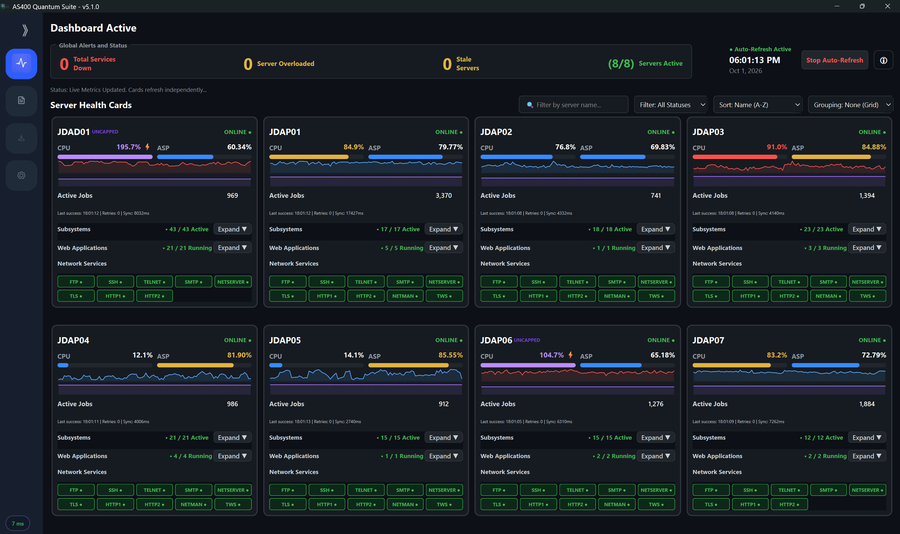
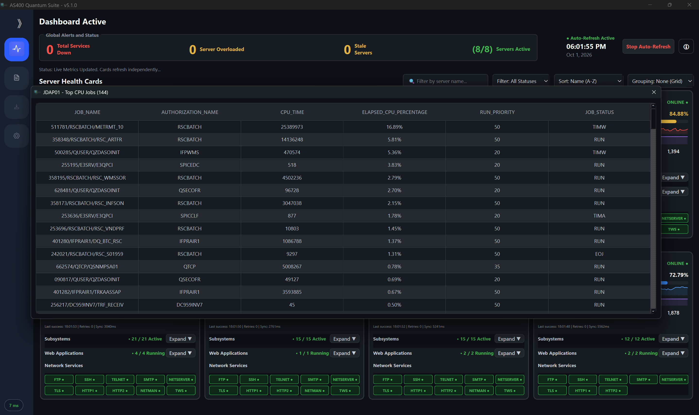
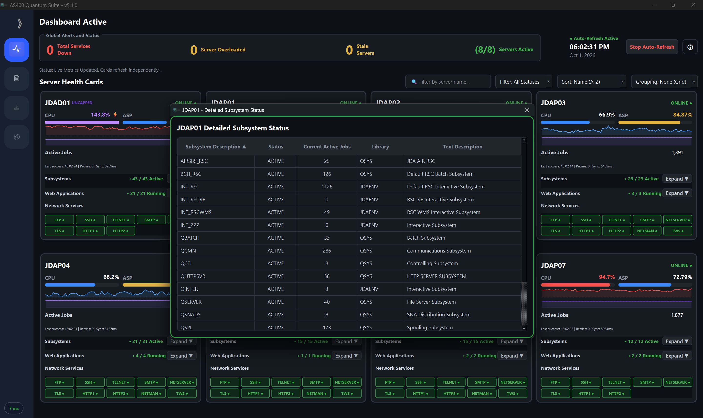
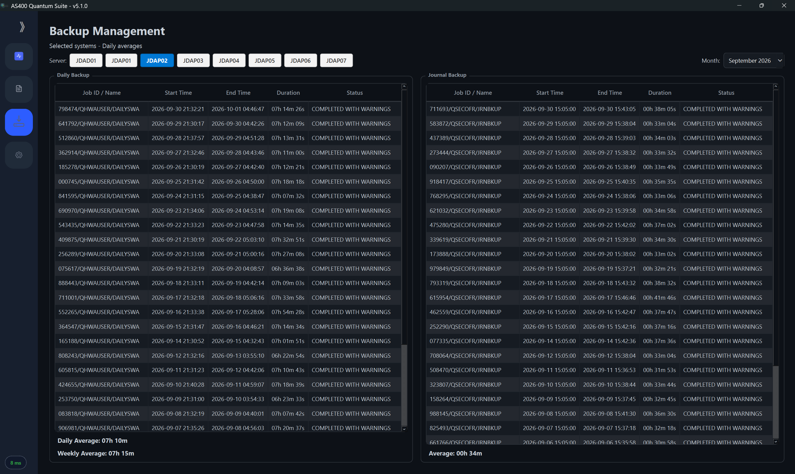
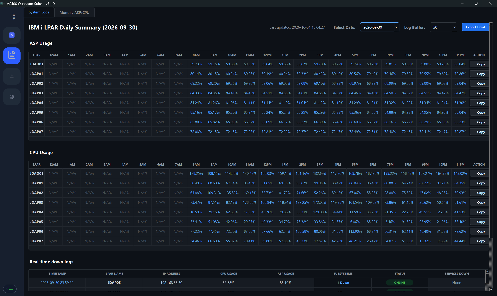
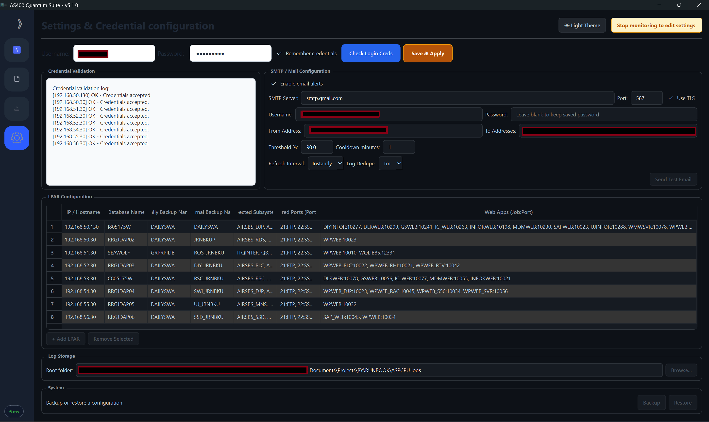

# AS400 Quantum Suite

**AS400 Quantum Suite 5.5.0** is a Windows desktop monitoring and operations dashboard for IBM i (AS/400) environments. It connects to configured IBM i systems through DB2/ODBC and presents live LPAR status, capacity metrics, service checks, backup history, and monthly reports in a PyQt6 application.

## Features

- **Live Monitor:** Per-server status cards for CPU, ASP, active jobs, subsystem health, web applications, and configured network services. Monitoring runs in background workers with per-server refresh and connection status.
- **ASP alerts:** The configured ASP threshold is the critical level. A warning is raised 2% below it by default; warnings are silent and highlighted orange, while critical alerts are highlighted red and sound. SMTP notifications include the server name, IP, current ASP usage, and configured critical threshold.
- **Server status alerts:** Server-down email notifications are delayed by three seconds and suppressed if the VPN disconnects or the server recovers during that delay.
- **Logs & Analytics:** Browse persisted monitoring history and monthly CPU/ASP trends. Export monthly reports to Excel and generate a report for the previous month.
- **Backup Management:** Review daily, weekly, monthly, and journal backup history in two panels by server and month, including duration, start/end times, and daily, weekly, and monthly averages.
- **Settings & Credentials:** Configure IBM i connections, expected subsystems and ports, email/SMTP alerts, refresh preferences, and the logs folder. Validate credentials, send a test email, and back up or restore application settings.
- **Startup checks:** Check the configured expiration date and compare the installed version with the published minimum supported version.

## Screenshots













## Requirements

- Windows 10 or later
- Python 3.10 or later for running from source
- IBM i Access ODBC driver (or compatible DB2 ODBC driver)
- Network access and valid credentials for the monitored IBM i systems
- SMTP server details if email alerts are required
- A writable local, network, OneDrive, or SharePoint folder for monitoring logs

Python dependencies are listed in `requirements.txt`. Password storage uses the operating system keyring when available; an SMTP password can also be supplied using `SMTP_PASSWORD` or `APP_SMTP_PASSWORD`.

## Run From Source

Install dependencies from the repository root:

```powershell
python -m pip install -r requirements.txt
```

Install and configure the IBM i ODBC driver, then start the application:

```powershell
python src/main.py
```

Use **Settings & Credentials** to configure server hosts/databases, credentials, expected subsystems and ports, email settings, and the log storage folder. Start monitoring from **Live Monitor** after validating the required credentials and network access.

## Configuration And Data

- Application settings are stored in the current user's application data directory under `AS400 Quantum Suite`.
- The log root is configurable in the application. If the preferred archive location is unavailable, log writes can fall back to the application's local logs folder.
- Monitoring snapshots are stored as daily JSON files and used by Logs & Analytics and monthly reports.
- Cleanup retains the current and previous calendar months for reporting; older canonical daily logs are subject to the 30-day retention policy.
- Keep settings backups and log archives in locations accessible to the operator account. Do not include credentials or private logs in public source-control commits.

## Build And Installer

The repository includes a PyInstaller spec and an Inno Setup script. On Windows, install the dependencies, then build the application bundle:

```powershell
pyinstaller AS400QuantumSuite.spec
```

The installer script `setup.iss` packages the generated `dist\AS400QuantumSuite` folder. Compile it with Inno Setup after the PyInstaller build.

## Tests

Run the pytest suite from the repository root:

```powershell
python -m pytest -q
```

Tests cover alert escalation and messaging, monitoring/log behavior, settings persistence, reporting, and dashboard interactions.

## Project Layout

```text
AS400QuantumSuite.spec   PyInstaller application bundle
setup.iss                Windows installer definition
version.json             Published version metadata
src/main.py              Application startup
src/config.py            Application metadata and paths
src/worker.py            IBM i queries, monitoring, alerts, and log workers
src/ui/                  Dashboard, logs, reports, backup, and settings UI
src/dialogs.py           Dialogs and configuration screens
src/version_worker.py    Remote version check
Image & Sound/           App icons and alert sounds
tests/                   Pytest regression tests
```

## Version Information

The application version is **5.5.0**. Startup checks enforce the configured build expiration and compare the installed version with the published minimum version. Published version metadata is checked using the URL configured in `src/config.py`.