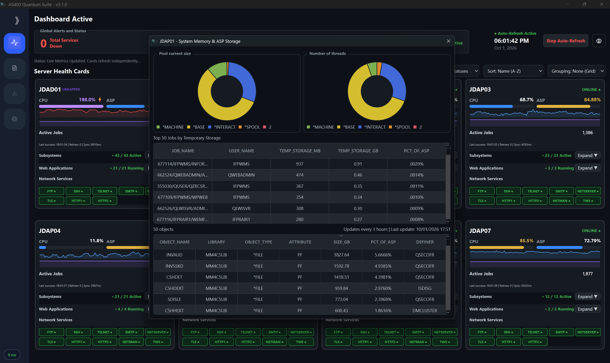
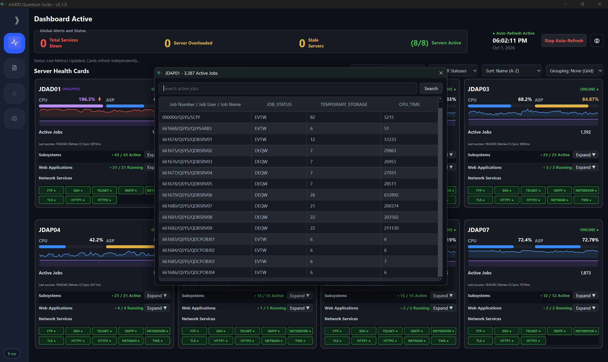
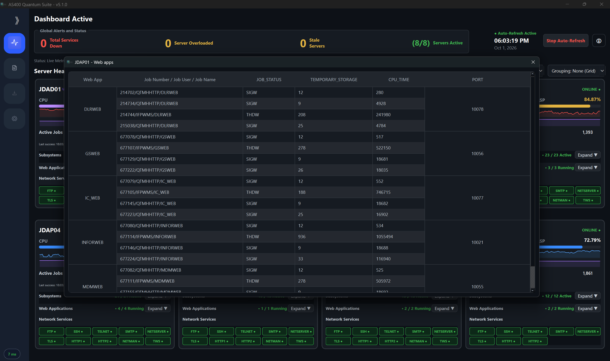
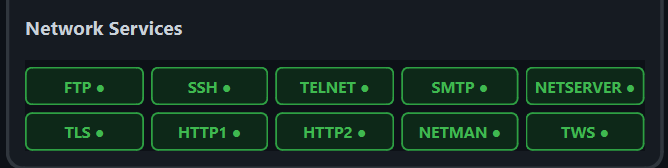
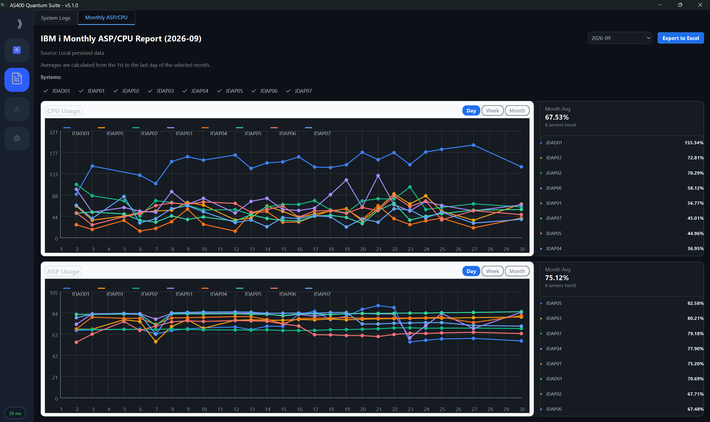
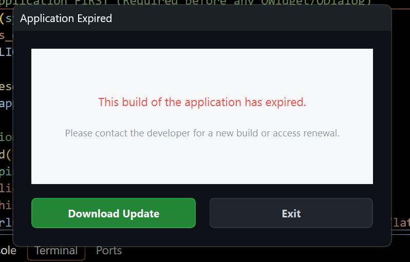

# AS400 Quantum Suite

AS400 Quantum Suite is a Windows desktop monitoring and operations dashboard for IBM i (AS/400) environments. It combines live IBM i telemetry, backup tracking, JSON history logging, and monthly reporting into a single PyQt-based application used by operators and engineers to monitor server health, key subsystem activity, and backup job performance.

The current codebase is aligned to version 5.1.0 and includes a GUI-driven monitoring workflow, configuration persistence, and backup/audit reporting features built around DB2/ODBC queries and local JSON archives.

## Overview

This project provides a single control center for:

- live IBM i / AS/400 health monitoring


- CPU, ASP, and active job tracking




- subsystem, Web Apps and service validation




- daily and journal backup auditing


- monthly log retention and historical review



- SMTP alert configuration and test messaging


- application version checks and update enforcement


## What the application does

The app connects to one or more IBM i hosts using DB2/ODBC and reads operational metrics and job data. It then surfaces the information through a desktop dashboard with navigation pages for monitoring, logs, reports, backup review, and settings.

Key capabilities in the current implementation include:

- LPAR and server status monitoring
- CPU and ASP trend visualization
- active job and temporary-storage analysis
- object statistics and ASP capacity reporting
- web app / service checks based on configured ports
- subsystem validation against expected values
- daily and journal backup job tracking
- deduplicated JSON log persistence by month
- monthly reporting and log browsing
- configurable email alerts and credential validation
- version expiration and minimum-version enforcement

## Architecture

The project is organized around a PyQt6 desktop app with background worker threads for DB2 calls and local persistence.

Core areas of the codebase:

- `src/main.py` — app bootstrap and startup checks
- `src/config.py` — version metadata, config paths, log roots, and resource paths
- `src/worker.py` — DB2 query workers, log writers, and backup collectors
- `src/dialogs.py` — operational dialogs and alert panels
- `src/ui/main_window.py` — main dashboard and navigation
- `src/ui/backup_manage.py` — backup management interface
- `src/ui/log_viewer.py` — log viewer UI
- `src/ui/monthly_report.py` — monthly report generation and charts
- `src/ui/setcreds.py` — credential and settings persistence
- `src/version_worker.py` — version checking thread
- `tests/` — regression and behavior tests for logging, settings, and dashboard behavior

## Requirements

### Minimum

- Windows 10 or later
- Python 3.10+
- PyQt6
- pyodbc
- IBM i Access ODBC driver or equivalent DB2/ODBC connectivity
- network access to the target IBM i system
- valid credentials for the monitored LPARs

### Optional but commonly required

- SMTP-capable mail relay for alerting
- OneDrive / SharePoint / network writable log root for archival logs
- VPN access when the IBM i system is not reachable directly

## Setup

1. Clone the repository.
2. Install Python dependencies:

```bash
pip install -r requirements.txt
```

3. Ensure the IBM i ODBC driver is installed and configured on the machine.
4. Launch the app from the project root:

```bash
python src/main.py
```

5. Configure server entries, credentials, monitored subsystems, and email settings through the app UI.

## Configuration

The app stores settings in a local config file under the current user application data directory, and supports a configurable logs root for monthly archival data.

Important configuration elements include:

- server host and database values
- expected subsystem names
- expected ports and app names
- email alert details and thresholds
- log archive path
- IBM i login credentials

## Logging and reporting

The monitoring layer stores historical operational snapshots in JSON files under the active logging root. The app supports:

- daily log capture and deduplication
- monthly archival grouping
- historical browsing by month
- report generation and export-friendly summaries

A few important design details from the codebase:

- log writes are serialized to avoid race conditions in multi-threaded monitoring
- duplicate daily records are filtered by server + timestamp semantics
- backup logs are separated by job type, including daily and journal categories
- fallback directories are used when the preferred SharePoint/log root is unavailable

## Security and version checks

The application includes a hardened startup check and version enforcement pattern:

- hard expiration date checks
- minimum supported version enforcement
- update check against the configured GitHub Pages metadata endpoint
- secure handling of credentials and email secrets in settings storage

## Running the project

From the repository root:

```bash
python src/main.py
```

If packaging is needed for a Windows build, the repo also includes a PyInstaller spec file and installer script:

- `AS400QuantumSuite.spec`
- `setup.iss`

## Project structure

```text
Pure-SQL/
├── AS400QuantumSuite.spec
├── README.md
├── requirements.txt
├── setup.iss
├── version.json
├── build/
├── build_scripts/
├── Image & Sound/
├── src/
│   ├── config.py
│   ├── data_store.py
│   ├── dialogs.py
│   ├── main.py
│   ├── version_worker.py
│   ├── worker.py
│   └── ui/
│       ├── backup_manage.py
│       ├── log_viewer.py
│       ├── main_window.py
│       ├── monthly_report.py
│       ├── setcreds.py
│       ├── styles.py
│       └── widgets.py
├── tests/
│   ├── test_hourly_log_recording.py
│   ├── test_log_root_settings.py
│   └── test_review_fixes.py
└── src/logs/
```

## Testing

The repository includes pytest-based checks covering:

- log root configuration behavior
- persisted settings backup round-tripping
- hourly log deduplication
- dashboard navigation and control behavior
- version and update validation rules

Use:

```bash
pytest
```

## Important notes

- Avoid trailing semicolons in DB2 SQL queries inside `src/worker.py`; they can trigger SQL errors under pyodbc.
- The app is designed primarily for Windows environments and IBM i/ODBC access patterns.
- If your environment uses OneDrive or SharePoint log archives, ensure the configured log root is writable and accessible.

## Status

This project is a functional desktop monitoring and auditing tool for IBM i systems, with ongoing operational tracking, reporting, and settings management implemented in the current codebase.

---

This README was updated to reflect the code now present in the repository, including the actual version, the current GUI structure, and the monitoring/reporting features implemented in the app.